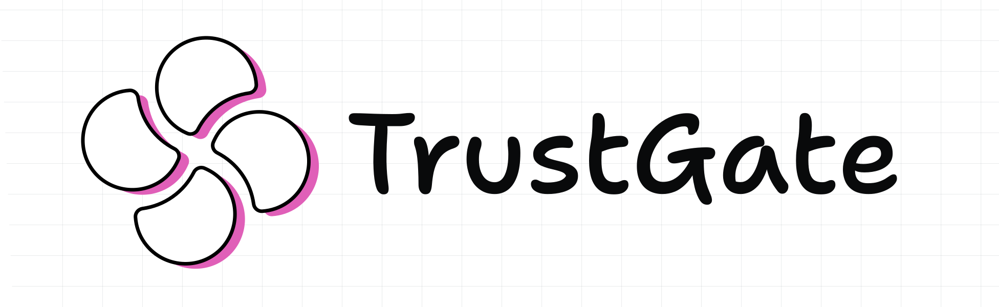

<div align="center">
  <a href="https://cohorte-ai.github.io/trustgate/">
    <picture>
      <source media="(prefers-color-scheme: dark)" srcset=".github/images/TheAIOS-TrustGate-darkmode.svg">
      <source media="(prefers-color-scheme: light)" srcset=".github/images/TheAIOS-TrustGate.svg">
      
    </picture>
  </a>
</div>

<div align="center">
  <h3>Know if your AI is ready to ship — one number, one guarantee.</h3>
</div>

<div align="center">
  <a href="https://opensource.org/licenses/Apache-2.0" target="_blank"></a>
  <a href="https://pypi.org/project/theaios-trustgate/" target="_blank"></a>
  <a href="https://arxiv.org/abs/2602.21368" target="_blank"></a>
  <a href="https://cohorte-ai.github.io/trustgate/" target="_blank"></a>
  <a href="https://x.com/CohorteAI" target="_blank"></a>
</div>

<br>

TrustGate certifies the reliability of any AI endpoint — LLMs, agents, RAG pipelines, or any system you can ask a question to. It uses self-consistency sampling and conformal prediction to produce a single **reliability level** (e.g., 94.6%) backed by a formal statistical guarantee. Not a vibe, not a leaderboard score — a mathematical proof.

**What's included:**

- **Self-consistency sampling** — ask the same question K times, measure agreement
- **Conformal calibration** — formal coverage guarantee, distribution-free
- **Human calibration** — shareable HTML questionnaire for domain experts (no server needed)
- **Runtime trust layer** — wrap any endpoint with reliability metadata
- **Sequential stopping** — Hoeffding bounds reduce API costs by ~50%
- **Profile diagnostics** — automatic detection of canonicalization failures

> [!NOTE]
> Part of the [theaios](https://github.com/Cohorte-ai) ecosystem. Install with `pip install theaios-trustgate`.

## Quickstart

```bash
pip install theaios-trustgate
```

```python
from theaios import trustgate

result = trustgate.certify(config_path="trustgate.yaml")
print(result.reliability_level)  # 0.946
```

The pipeline: sample K responses → canonicalize → calibrate with conformal prediction → get a reliability level with a guarantee. Works with any provider (OpenAI, Anthropic, self-hosted), any task type, fully black-box.

> [!TIP]
> For the full theory, see our paper: [*Black-Box Reliability Certification for AI Agents via Self-Consistency Sampling and Conformal Calibration*](https://arxiv.org/abs/2602.21368) (Mouzouni, 2026).

## Three Ways to Use TrustGate

### 1. Deployment gate — certify before shipping

```bash
trustgate certify --yes
# Exit code 0 = PASS, 1 = FAIL
```

```
     TrustGate Certification Result
┌──────────────────────┬──────────┐
│ Reliability Level    │ 94.6%    │
│ M* (prediction set)  │ 1        │
│ Empirical Coverage   │ 0.956    │
│ Capability Gap       │ 2.4%     │
│ Status               │ PASS     │
└──────────────────────┴──────────┘
```

### 2. Runtime trust layer — confidence on every query

```python
from theaios.trustgate import TrustGate, certify

result = certify(config_path="trustgate.yaml")
gate = TrustGate(config=config, certification=result)

# Passthrough (1 API call): attaches reliability metadata
response = gate.query("What is the treatment for X?")
response.reliability_level  # 0.946

# Sampled (K API calls): per-query prediction set
gate = TrustGate(config=config, certification=result, mode="sampled")
response = gate.query("What is the treatment for X?")
response.prediction_set  # ["Aspirin + PCI"]
response.consensus       # 0.8
```

### 3. Human calibration — no ground truth needed

Generate a questionnaire, share it with a domain expert, certify with their labels:

```bash
trustgate calibrate --export questionnaire.html
# Share via email/Slack → reviewer opens in browser → downloads labels.json
trustgate certify --ground-truth labels.json
```

## Where Do the Questions Come From?

You don't need a gold-standard dataset to use TrustGate. Three ways to get started:

**1. Generate questions with AI.** Ask an LLM to produce realistic questions for your system:
```
"Generate 100 realistic customer support questions that users would ask
our e-commerce chatbot, covering orders, returns, shipping, and products."
```

**2. Extract from production logs.** Pull real queries from your observability stack (Datadog, Langfuse, LangSmith, custom logs). These are the actual questions your system faces — the most representative test set possible.

**3. Use built-in benchmarks.** For standard tasks, TrustGate ships dataset loaders:
```python
from theaios.trustgate.datasets import load_gsm8k, load_mmlu
questions = load_mmlu(subjects=["abstract_algebra"], n=100)
```

No ground truth labels? No problem — use [human calibration](https://cohorte-ai.github.io/trustgate/human-calibration/). A domain expert reviews 50 items in 10 minutes.

→ **[Full guide: Getting Your Questions](https://cohorte-ai.github.io/trustgate/getting-questions/)**

## Works With Any Endpoint

LLMs, agents, RAG pipelines — anything with an HTTP API:

```yaml
# LLM
endpoint:
  url: "https://api.openai.com/v1/chat/completions"
  model: "gpt-4.1"
  api_key_env: "OPENAI_API_KEY"

# Generic agent / RAG / custom API
endpoint:
  url: "https://my-agent.example.com/api/ask"
  temperature: null
  request_template:
    query: "{{question}}"
  response_path: "answer"
  cost_per_request: 0.03
```

## Certify Each Component, Not Just the Final Output

Complex AI systems are pipelines — retriever, reranker, reasoning, generation. Don't certify the whole pipeline as a black box. **Certify each component independently** to find exactly where reliability breaks down.

```
Query → [Retriever] → [Reranker] → [Generator] → Answer
            ↑              ↑             ↑
      certify: 94%    certify: 91%   certify: 87%
      "right docs?"  "right order?" "right answer?"
```

Each component is just an endpoint — TrustGate certifies it independently with its own questions, canonicalization, and reliability level. This lets you:

- **Pinpoint failures**: the generator is the weak link, not the retriever
- **Iterate efficiently**: improve one component, re-certify just that one
- **Stay agnostic**: document changes don't invalidate the retriever certification

| Component | Certify on | Canonicalization |
|-----------|------------|------------------|
| RAG retriever | Retrieved document IDs | Exact match |
| SQL agent | Generated SQL query | Normalized SQL |
| Classification step | Category label | MCQ |
| Reasoning step | Intermediate conclusion | LLM-judge or custom |
| Final answer | Short structured output | Numeric / MCQ |

TrustGate warns you automatically when outputs are too long or diverse for meaningful self-consistency measurement.

## Pre-flight Cost Estimate

Before spending money, TrustGate shows the cost/reliability tradeoff:

```
     Cost / Reliability Tradeoff
┌────┬───────────┬──────────┬────────────┐
│  K │ Est. Cost │ Max Cost │ Resolution │
│  3 │ $9.00     │ $18.00   │   coarse   │
│  5 │ $15.00    │ $30.00   │  moderate  │
│ 10←│ $30.00    │ $60.00   │    fine    │
│ 20 │ $60.00    │ $120.00  │    fine    │
└────┴───────────┴──────────┴────────────┘
Proceed? [Y/n]:
```

---

## Documentation

- [cohorte-ai.github.io/trustgate](https://cohorte-ai.github.io/trustgate/) — Full documentation
- [Concepts](https://cohorte-ai.github.io/trustgate/concepts/) — How self-consistency + conformal prediction works
- [Configuration](https://cohorte-ai.github.io/trustgate/configuration/) — Full YAML reference
- [CLI Reference](https://cohorte-ai.github.io/trustgate/cli/) — All commands and flags
- [Human Calibration](https://cohorte-ai.github.io/trustgate/human-calibration/) — Questionnaire and review UI
- [API Reference](https://cohorte-ai.github.io/trustgate/api-reference/) — Python API

## Additional Resources

- **[Examples](examples/)** — Working certification scripts
- **[FAQ](https://cohorte-ai.github.io/trustgate/faq/)** — Common questions
- **[Paper](https://arxiv.org/abs/2602.21368)** — The research behind TrustGate

---

## Why TrustGate?

- **Formal guarantee** — conformal coverage bound, not a heuristic score
- **Black-box** — no model internals, no logprobs, just API access
- **Any endpoint** — LLMs, agents, RAG, custom APIs
- **Human-in-the-loop** — shareable questionnaire, no server needed
- **Cost-aware** — pre-flight estimates, sequential stopping saves ~50%
- **Production-ready** — passthrough mode, CI/CD gating, periodic recalibration

---

## Citation

```bibtex
@article{mouzouni2026trustgate,
  title={TrustGate: Black-Box AI Reliability Certification via
         Self-Consistency Sampling and Conformal Calibration},
  author={Mouzouni, Charafeddine},
  year={2026}
}
```

## License

Apache 2.0. See [LICENSE](LICENSE).
